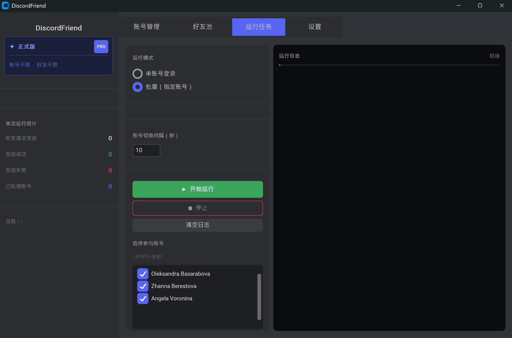
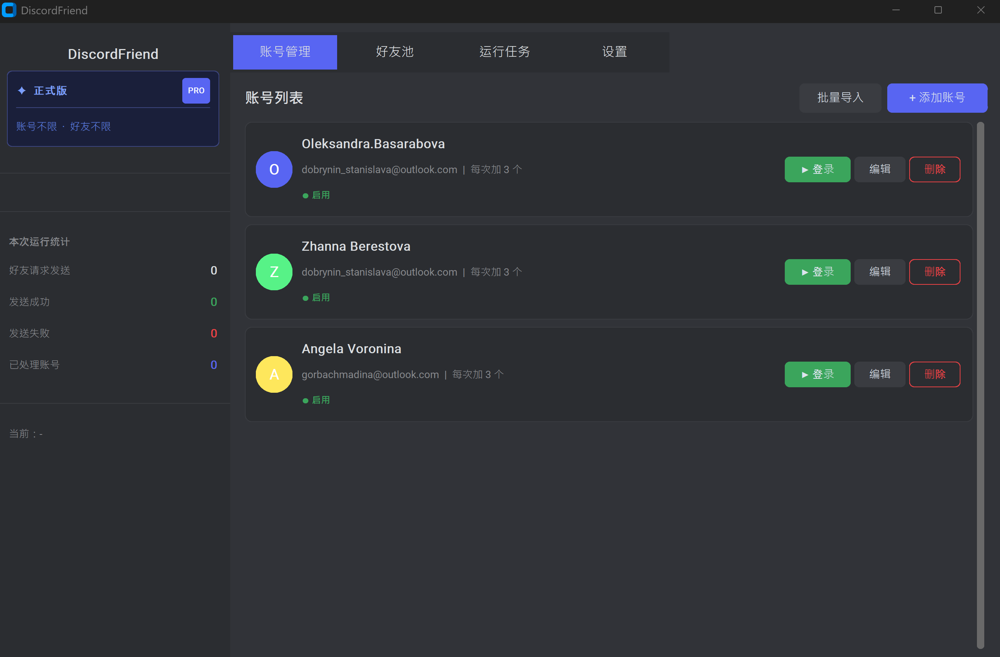
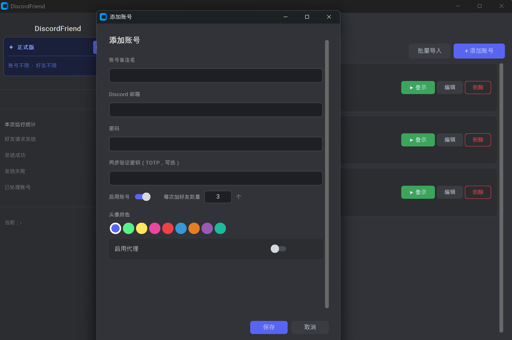

# DiscordFriend

### 轻松拓展你的 Discord 社交圈

---



---

## 为什么选择 DiscordFriend？

每天手动一个个搜索、添加好友，费时又费力。
**DiscordFriend** 帮你把这件事变成一键完成。

导入好友目标列表，配置好账号，点击开始 —— 剩下的交给它。

---

## 它能做什么

**批量添加好友**
支持同时管理多个 Discord 账号，自动轮流登录、逐一发送好友请求，全程无需盯着屏幕。

**智能好友池**
把所有目标用户名统一放入好友池，系统自动分配给每个账号，已添加的自动移除，不重复、不遗漏。

**自动处理验证**
登录验证、两步验证、人机验证，全部自动完成，不卡流程。

**完整发送记录**
每一条好友请求的发送结果都有记录，随时查阅，清楚掌握进度。

---



---

## 简单到不需要教程

```
第一步：导入账号
第二步：粘贴目标用户名
第三步：点击开始
```

就这三步，其余全部自动完成。

---

## 版本说明

| | 试用版 | 正式版 |
|---|---|---|
| 账号数量 | 有上限 | **不限** |
| 每次加好友数量 | 有上限 | **不限** |
| 自动登录 | ✓ | ✓ |
| 两步验证支持 | ✓ | ✓ |
| 发送记录 | ✓ | ✓ |
| 代理支持 | ✓ | ✓ |

---



---

## 适合谁用

- 需要快速积累 Discord 好友的运营人员
- 管理多个账号的社群运营者
- 希望提升 Discord 推广效率的个人用户

---

> 授权码购买请联系客服。
欢迎技术交流、问题反馈、合作探讨：
Feel free to reach out for technical discussions, feedback, or collaboration:

Telegram
https://t.me/wikijoseph

Discord
wikiJoseph#1735

Bilibili
https://space.bilibili.com/1561886967

Youtube
https://www.youtube.com/channel/UC-ViN6WFew9-DVaw9F1WARw


