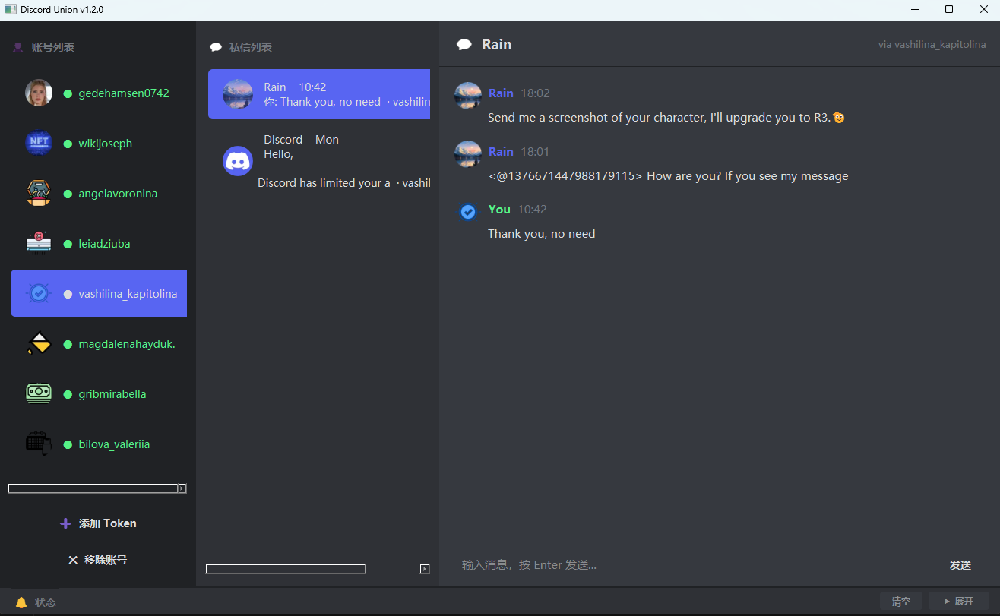

# Discord Union v1.2.0 使用说明

> 多账号 Discord 私信实时监控工具

---

---

## 功能介绍

### 多账号管理
支持同时添加多个 Discord 账号，所有账号的私信统一汇聚在一个窗口中管理，无需反复切换。

### 实时消息提醒
收到新私信时，软件会同时触发桌面弹窗通知、标题栏闪烁以及声音提示，确保不会错过任何消息。

### 查看与回复
点击左侧对话列表，右侧即可显示完整的聊天历史记录，并可直接在软件内输入并发送回复。

### 图片内联显示
消息中的图片附件会直接渲染在对话框内，无需另外打开链接或浏览器。

### 配置自动保存
账号 Token 与授权信息自动保存到本地，关闭后重新打开无需重复输入。

---

## 使用步骤

1. **输入授权码**：首次启动时，按提示输入授权码完成验证。

2. **添加账号**：点击界面中的「添加账号」按钮，粘贴 Discord 用户 Token，程序将自动连接。

3. **查看私信**：连接成功后，左侧列表会显示所有私信对话，点击即可查看聊天记录。

4. **发送消息**：在底部输入框中输入内容，按回车或点击发送按钮即可回复。

5. **管理账号**：如需移除某个账号，在账号列表中点击对应的删除按钮即可。

